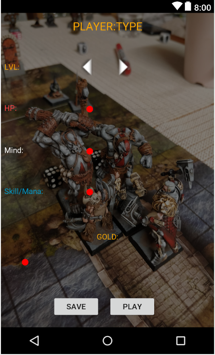

# Absolution
1.0

-Interface for my friends board game made with Kotlin

 

-This was originally test project to try Android Kotlin development. This project has now stopped and moved to 
 React native platform. 
 

  
 

 -This app is fully working
 
  
  
 
Features:
 -sqlite database 
  
 -Camera
  
  
 
 
 
